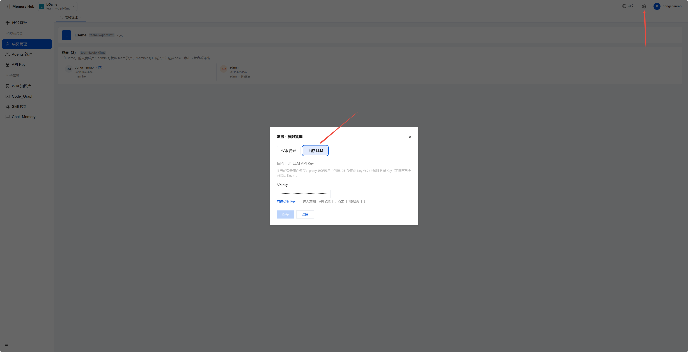
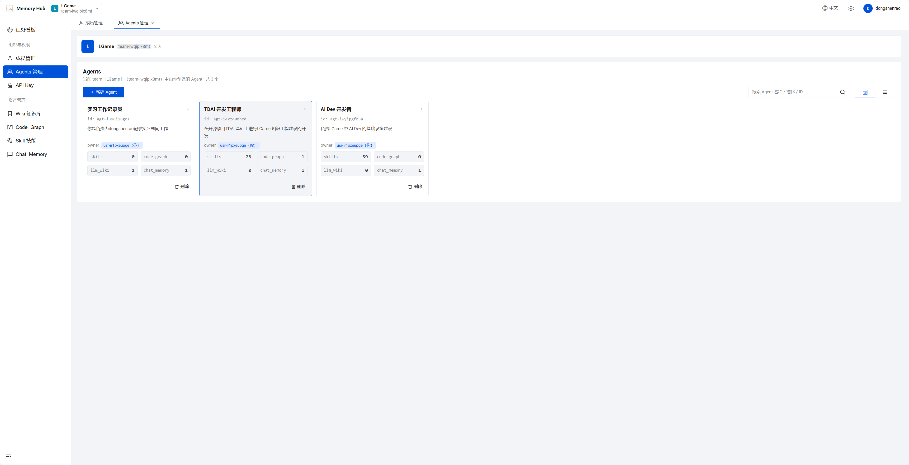
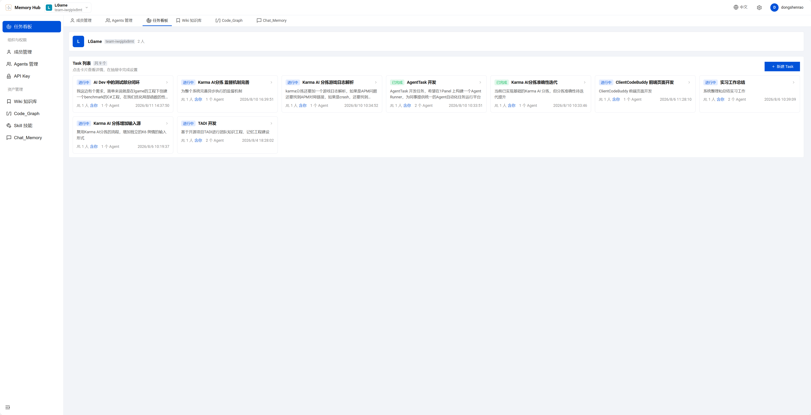
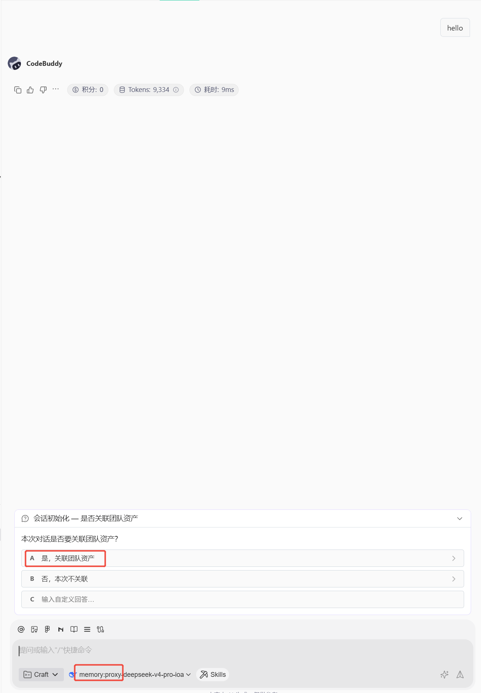
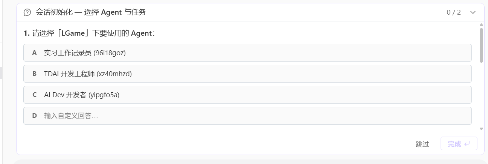
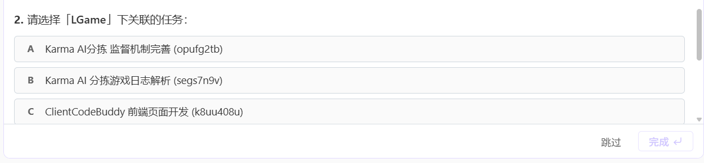
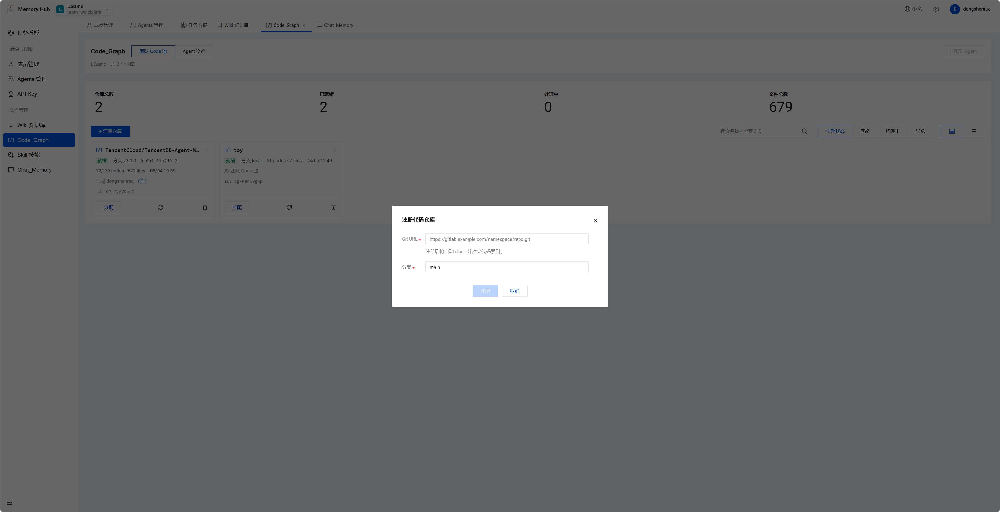

# LGame 知识与记忆工程使用指南

## 1. 登录

获取个人 API-KEY（`sk-mem...` 格式）后，打开链接 [http://dongshenrao-any2.devcloud.woa.com:8125/#/team/members](http://dongshenrao-any2.devcloud.woa.com:8125/#/team/members)，输入 API-KEY 完成登录。

## 2. 配置 LLM

点击右上角「设置」，进入上游 LLM 配置界面。

点击「前往获取 Key」获取 CodeBuddy 的 API Key，填入并保存。

## 3. 开始使用

### 3.1 创建自己的 Agent

该 Agent 收集到的资产（如 Skill、Chat Memory）会自动保存到其资产库中。默认只有你自己可见；如需共享给团队其他成员，需在面板上手动操作「团队分享」后，其他 Agent 才能访问。

### 3.2 创建自己的任务

任务在团队中是共享的，一个任务可由多个 Agent、多个用户协作完成。它们仅共享任务描述，**不会共享对话上下文**（对话资产由各自的 Agent 管理，隐私不受影响）。

### 3.3 在 CodeBuddy 中使用

配置好初始化 Hook 后：

1. 在 LGame 项目中，`unshelve CL 4794028` 开始使用。
2. 新开一个会话，与 CodeBuddy 对话一次，系统会自动配置 `~/.codebuddy/models.json` 并创建 `.codebuddy/project-config-personal.json`。
3. 在 `project-config-personal.json` 的 `tai` 字段中配置 API Key（**注意：这里填写的是登录用的 `sk-mem...` 格式 Key，不是 CodeBuddy 的 API Key**）。
4. 新开一个会话，选择名称以 `memory:proxy` 开头的模型进行对话。

每次新会话启动时，会弹出选择框让你绑定该会话所属的**团队**、**Agent** 和**任务**：

绑定成功后，即可在该会话中使用和积累资产。

## 4. 各类资产

### 4.1 CodeGraph

**官方用法**：在面板上输入 Git 仓库地址创建。

**扩展用法**（自行开发）：支持对本地目录创建 CodeGraph。在绑定成功的会话中直接输入 Prompt，要求对某个目录创建 CodeGraph 即可（该功能试用中，如有问题请联系）。

创建成功后，需在面板上将 CodeGraph 分配绑定到目标 Agent 上才能使用。

### 4.2 Wiki 知识库

在面板上创建 Wiki 知识库后，上传 Markdown 文档即可自动构建。

### 4.3 Skill 技能

会话过程中会自动积累 Skill，该过程不会影响 CodeBuddy 本地的 Skill 使用。

### 4.4 Chat Memory

会话过程中会自动记录对话原文，并在达到一定轮数后，逐层抽取：
- **L1** 原子记忆
- **L2** 场景记忆
- **L3** 核心记忆

可在面板上进行分配和管理。默认仅用户自己可见，可选择共享为团队资产。
